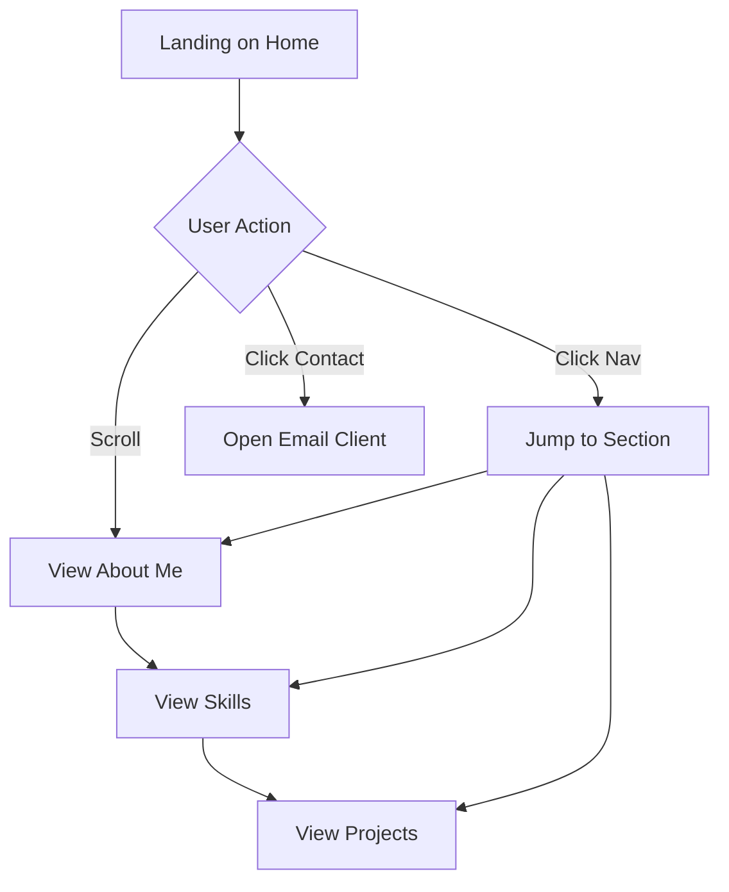

## 1. Product Overview
A single-page portfolio website for a developer, showcasing personal information, skills, and projects based on the provided reference site (`https://sahil-kumar-nehra.netlify.app/`).
- Serves as a digital resume and project showcase to attract clients or employers.
- Highlights technical expertise, creative problem-solving, and a passion for web development.

## 2. Core Features

### 2.1 User Roles
Not applicable. This is a public-facing static portfolio without authentication.

### 2.2 Feature Module
1. **Home section**: Hero area with an introduction, a typing effect or bold typography, and a "Let's Talk!" call to action.
2. **About Me section**: Personal background, journey into web development, and a link to download the resume.
3. **Skills section**: Categorized lists of technical skills (e.g., Tech Stack, Operating Systems, Cloud Platforms).
4. **Projects section**: Display of past projects with brief descriptions and links.

### 2.3 Page Details
| Page Name | Module Name | Feature description |
|-----------|-------------|---------------------|
| Single Page Portfolio | Navbar | Sticky navigation with links to Home, About, Skills, and Projects. |
| Single Page Portfolio | Home | High-impact visual introduction with name and title. |
| Single Page Portfolio | About Me | Text description of background and philosophy. |
| Single Page Portfolio | Skills | Grid or list of skills grouped by category. |
| Single Page Portfolio | Projects | Cards or list items detailing individual projects. |
| Single Page Portfolio | Footer | Contact information and "Get in Touch" prompt. |

## 3. Core Process
The user visits the site, lands on the Home hero section, and can either scroll down sequentially or use the top navigation to jump directly to About, Skills, or Projects. They can interact with the "Let's Talk!" button or the "Resume" link to take action.

## 4. User Interface Design
### 4.1 Design Style
- Primary and secondary colors: Dark theme (e.g., black/dark gray background) with vibrant accent colors (e.g., neon green or blue) to match a "hacker/tech geek" aesthetic.
- Button style: Minimalist with hover effects, possibly a neon glow or stark borders.
- Font and sizes: Distinctive display font for headings (e.g., a modern geometric or monospace font), clean sans-serif for body text.
- Layout style: Single-page scroll, full-height sections, generous negative space.
- Icon/emoji style suggestions: Minimalist line icons (Lucide React).

### 4.2 Page Design Overview
| Page Name | Module Name | UI Elements |
|-----------|-------------|-------------|
| Portfolio | Hero | Large typography, dark background, accent color highlights, smooth fade-in animation. |
| Portfolio | About | Two-column layout (text + optional image/graphic), readable line length. |
| Portfolio | Skills | Categorized badges or lists, hover animations for individual skills. |
| Portfolio | Projects | Card grid layout, project screenshots/icons, tags for tech stack. |

### 4.3 Responsiveness
Desktop-first, mobile-adaptive. Sections will stack vertically on smaller screens, navigation will collapse into a hamburger menu.
