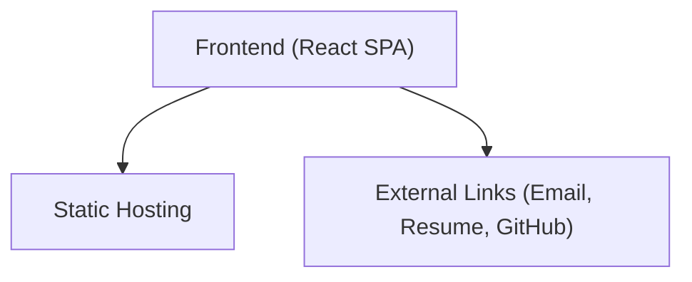

## 1. Architecture Design

## 2. Technology Description
- Frontend: React@18 + tailwindcss@3 + vite
- Initialization Tool: vite-init
- Routing: React components with smooth scrolling via IDs
- Icons: lucide-react
- Styling: Tailwind CSS for utility-first styling and responsiveness.

## 3. Route Definitions
| Route | Purpose |
|-------|---------|
| / | Main single-page application containing all sections |

## 4. API Definitions
Not applicable. The site is static and does not require a backend.

## 5. Server Architecture Diagram
Not applicable.

## 6. Data Model
### 6.1 Data Model Definition
Not applicable. Data (skills, projects) will be managed in a configuration file or constants folder for easy updating.

### 6.2 Data Definition Language
Not applicable.
